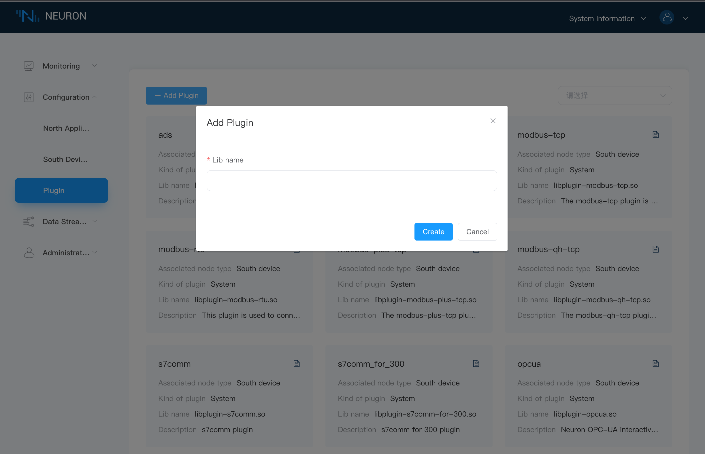

# Pluggable Modules Management

## Step 1 Check over all available Modules

The plugin management page displays all the pluggable modules available and detailed information, including the name of the plug-in, associated node type, plug-in category and driver library name, as shown in the following figure. 

The plug-in types include the following 3 modes:

* Static: cannot be deleted
* System: cannot be deleted, native
* Custom: Deletable, user-developed or custom-developed

::: tip
Users can filter out the plugins for northbound applications or southbound devices from the dropdown box.
:::

## Step 2 Add a new Pluggable Module

Click on the `Add Plugin` button in the upper right corner as shown below

To add a new Pluggable module,

1. Fill in the path and file name of the .so file that needs to be added.
2. Click on the `Create` button to move .so file to the build directory.

