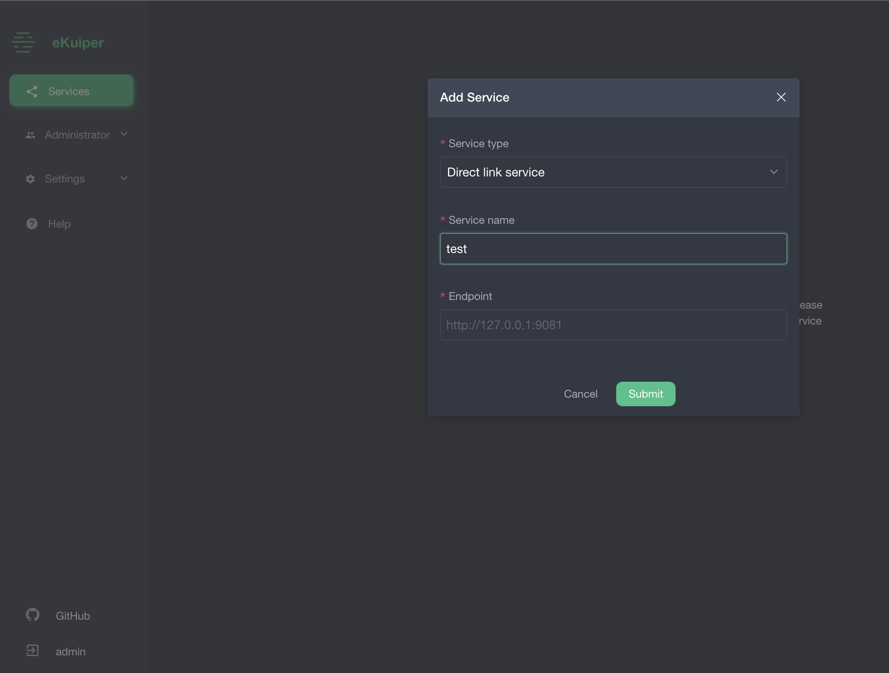
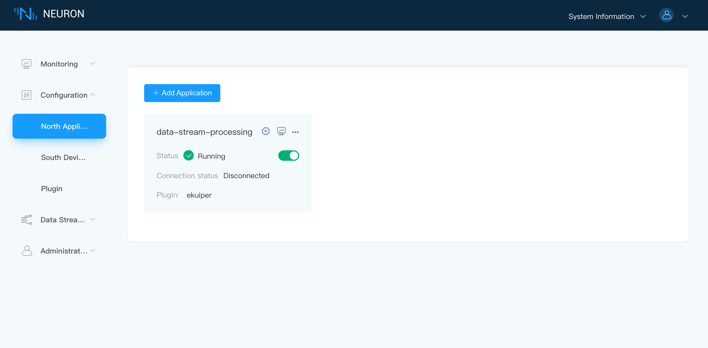

# Prerequisite Setup

## Installstion

### Neuron-plus

Because the neuron-plus version integrates eKuiper, and the page adds a data stream processing section, so only the Neuron-plus version needs to be installed.

```shell
$ sudo docker pull emqx/neuron-plus:latest
$ sudo docker run -d --name neuron -p 7000:7000 -p 7001:7001 --privileged=true --restart=always emqx/neuron-plus:latest
```
### Install Neuron and eKuiper separately

Users can choose to install Neuorn and eKuiper separately, and use docker-compose to install and configure them directly. The docker-compose.yml example is as follows, and the installed version can be selected according to requirements.

```python
version: '3.4'

services:

  ekuiper-manager:
    image: emqx/ekuiper-manager:1.5.0
    container_name: ekuiper-manager
    ports:
      - "9082:9082"

  ekuiper:
    image: lfedge/ekuiper:1.5.1-slim
    hostname: ekuiper
    container_name: ekuiper
    ports:
      - "9081:9081"
      - "127.0.0.1:20498:20498"
    environment:
      MQTT_SOURCE__DEFAULT__SERVER: tcp://broker.emqx.io:1883
      KUIPER__BASIC__CONSOLELOG: "true"
      KUIPER__BASIC__IGNORECASE: "false"
    volumes:
      - nng-ipc:/tmp

  neuron:
    image: emqx/neuron:2.2.4
    hostname: neuron
    container_name: neuron
    ports:
      - "7000:7000"
      - "7001:7001"
    volumes:
      - nng-ipc:/tmp

  source:
    image: alpine/httpie
    container_name: httpie
    command:
      - --ignore-stdin
      - --check-status
      - ekuiper:9081/streams
      - sql=CREATE STREAM neuronStream() WITH (TYPE="neuron",FORMAT="json",SHARED="true");
    depends_on:
      - ekuiper
      - neuron

volumes:
  nng-ipc:%  
```

After successful execution, Neuron and eKuiper have been started respectively.

Login to kuiper-manager.

* Address: `http://$yourhost:9082`
* User name: admin
* Password: public

Add the service as shown.



:::tip
The address in Endpoint should fill in the local address where eKuiper is launched.

After adding the service, because docker-compose has created a data stream, there should be a **neuronStream** stream in the newly created service.

For the specific operation of eKuiper, please refer to [ekuiper Introduction](https://ekuiper.org/docs/en/latest/operation/manager-ui/overview.html#install-the-management-console)
:::

## Dashboard

There is a pre-defined a data stream named `neuronStream` with type attribute `neuron` in data stream engine. Users are required to subscribe the desired data Groups of southbound devices. The subscribed data Groups will be the data stream for stream engine. All rules in stream engine would share this data stream.

### Step 1 Check over the data stream processing application node

When you install a .deb or .rpm Neuron package, there is a default `data-stream-processing` application node in the northbound application management screen, as shown below.



The data stream processing node contains the following information

* Application Name - **data-stream-processing**
* Node Status - **Init**
* State Change Button - OFF
* Connection Status - **Disconnected**
* Plugin Module Name - **ekuiper**

### Step 2 Subscribe to data groups of southbound devices

Click on any blank space of the `data-stream-processing` application node to enter the Group list screen for subscribing to the group, as shown below.


To subscribe the data Groups of southbound device,

1. Click on the `Add subscription` button in the top right corner.
2. Click on the drop down box to select the southbound device, in this case, we select the modbus-tcp-1 device built above.
3. Select the Group you want to subscribe to in the drop-down box, in this case, we select the group-1 created above.
4. Click on `Submit` button to complete the subscription.
