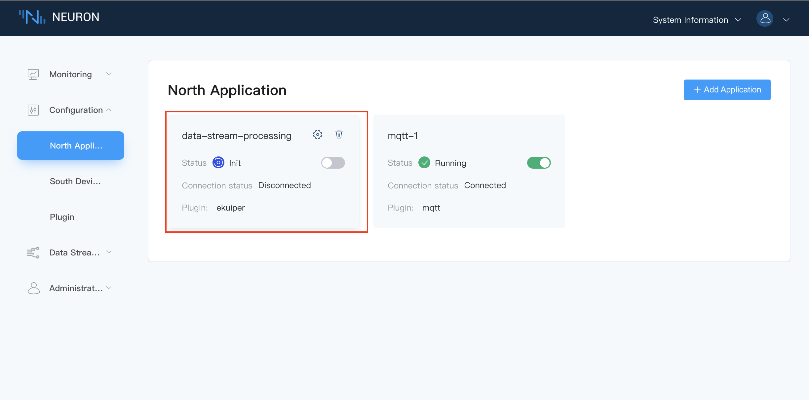
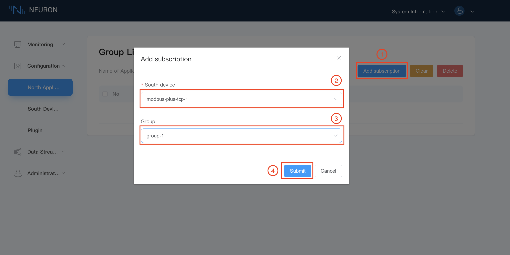
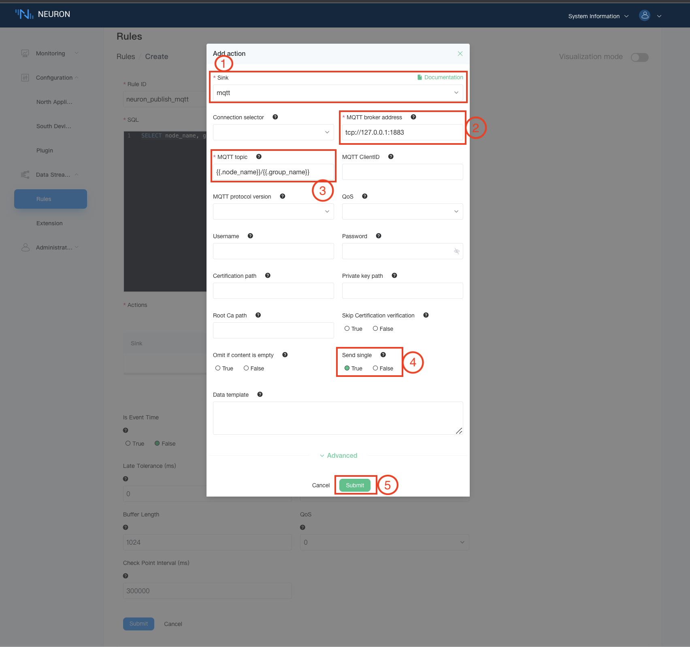
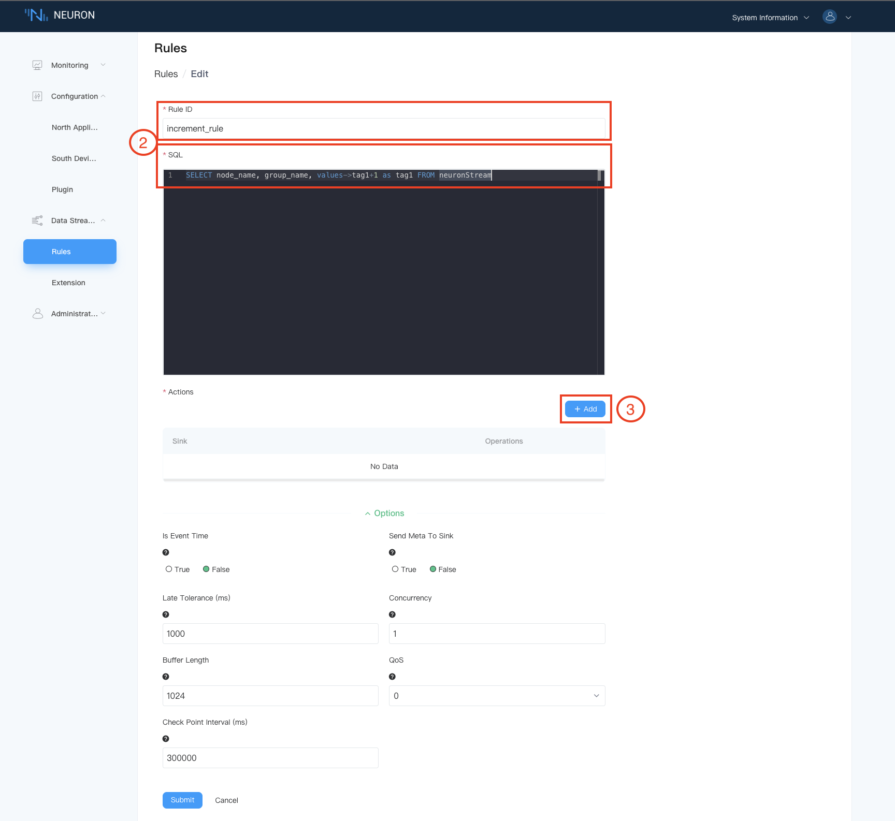
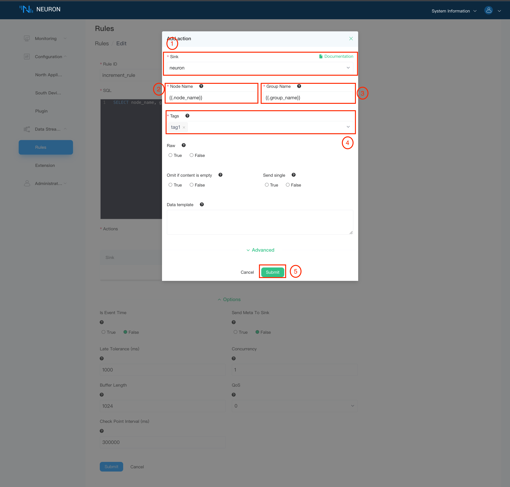
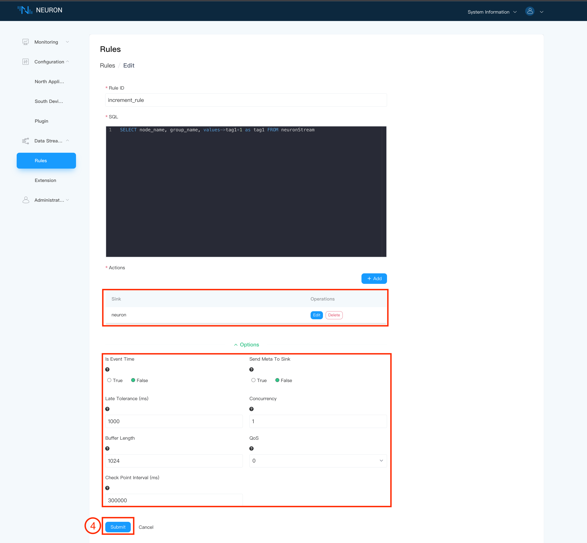
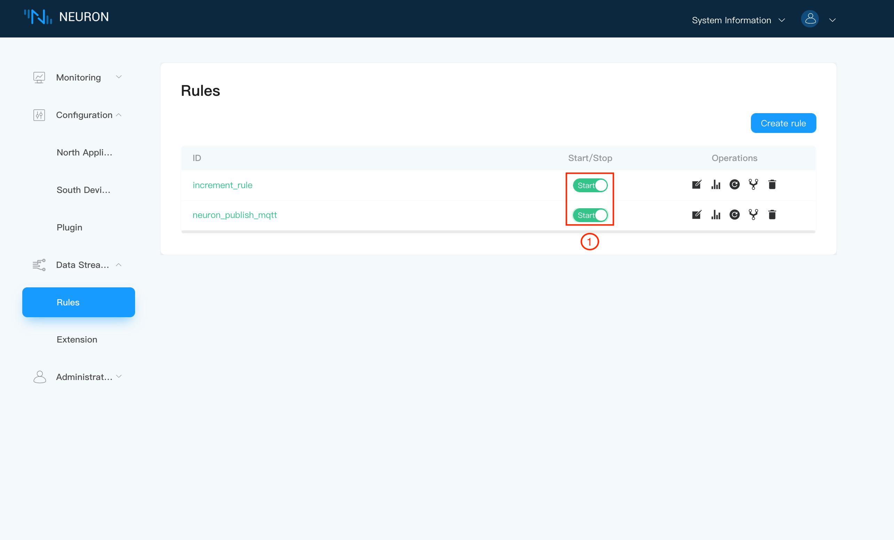

# Data Processing Engine

There is a pre-defined a data stream named `neuronStream` with type attribute `neuron` in data stream engine. This data stream is all collected data from various southbound drivers. All rules would share this data stream. This section describes two rules of **data cleaning for cloud** and **device control**.

**Step 1**, Subscribe Groups for data stream node.

Click on `data-stream-processing` application node to go to the Group Subscription screen.

1. Click on the `Add subscription` button in the top right corner to add a subscription.
2. Click on the drop down box to select the southbound device, in this case, we select the modbus-plus-tcp-1 device built above.
3. Select the Group you want to subscribe to in the drop-down box, in this case, we select the group-1 created above.
4. Click on `Submit` button to complete the subscription.

**Step 2**, Add rules for cleaning data to the cloud

This rule implements +1 processing of the data collected by the neuron from the device, renames it to a meaningful name, and sends the result to the MQTT dynamic topic `${node_name}/${group_name}` in the cloud.

1. Click `New Rule` to create a new rule in the rule page.
2. Fill in the `Rule ID` and `SQL` statement.
3. Click on `Add` button to add sink action for the rule, you may add more than one sink action for each rule.
4. Click on `Submit` button to complete the rule definition.

::: v-pre
1. Fill in the name of sink action.
2. Fill in the MQTT broker address.
3. Fill in the MQTT topic, in this case, we have `{{.node_name}}/{{.group_name}}`.
4. Select the `True` for send single.
5. Click on `Submit` button to complete the sink action.
:::

The rule has shown as below

1. Start rule execution.

::: v-pre
1. Start MQTTX client, subscribe the topic `{{.node_name}}/{{.group_name}}`.
:::

::: tip
The node_name used in this example is **modbus-plus-tcp-1** and the group_name is **group-1**, that is, the subscription topic is modbus-plus-tcp-1/group-1.
:::

**Step 3**, Add rules for controlling devices

This rule implements +1 processing of the data collected by neuron from the device, and neuron writes the result back to the device. At this time, the tag attribute must be a write attribute, otherwise it cannot be written successfully.

1. Click `New Rule` to create a new rule in the rule page.
2. Fill in the `Rule ID` and `SQL` statement.
3. Click on `Add` button to add sink action for the rule, you may add more than one sink action for each rule.
4. Click on `Submit` button to complete the rule definition.

1. Fill in the name of sink action.
2. Fill in the node name.
3. Fill in the group name.
4. Fill in the tag name.
5. Click on `Submit` button to complete the sink action.

The rule has shown as below

1. Start rule execution.

1. Start neuron data monitoring, check data.