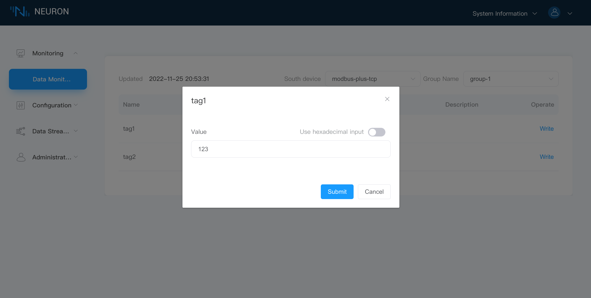
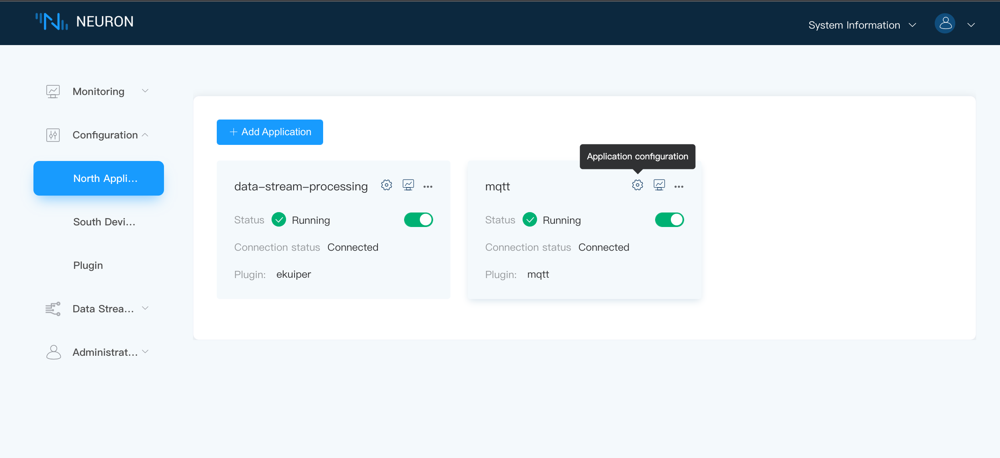
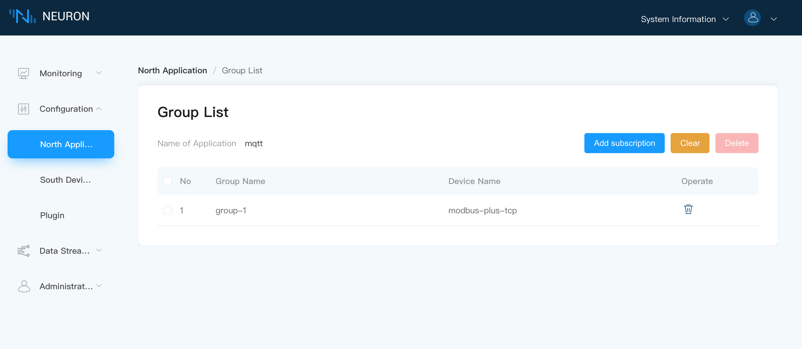

# Quick Start

## Environment setup

### Package Installation

The environment used in this example is Ubuntu 20.04.3, armv71.

1. Download the installation package
Neuron packages can be downloaded from the Neuron website [https://neugates.io/downloads](https://neugates.io/downloads).

2. Unzip the installation package
Unzip the package into any directory (e.g. /home/Neuron) and enter the command：

```bash
sudo dpkg -i neuron-2.1.0-linux-armhf.deb
```

::: tip
After successful installation of the deb package, Neuron is automatically started.
:::

### Neuron operation

#### Checking Neuron Status

```bash
sudo systemctl status neuron
```

#### Stop Neuron

```bash
sudo systemctl stop neuron
```

#### Restart Neuron

```bash
sudo systemctl restart neuron
```

### Running EMQX in Docker

We need to deploy an MQTT Broker to do the connection processing of messages, here we recommend using EMQX. Again EMQX can be installed and used quickly using a Docker container.The latest version can be obtained from the [EMQX](https://www.emqx.com/en/try?product=broker).

1. Get the Docker image

```bash
docker pull emqx/emqx:4.4.3
```

2. Start the Docker container

```bash
docker run -d --name emqx -p 1883:1883 -p 8081:8081 -p 8083:8083 -p 8084:8084 -p 8883:8883 -p 18083:18083 emqx/emqx:4.4.3
```

### Install Modbus Simulator

Install PeakHMI Slave Simulator, download the software from the [PeakHMI official website](https://hmisys.com).
After installation, open the Modbus TCP slave.

::: tip
Disable the firewall on Windows, otherwise the Neuron may not be able to connect to the simulator.
:::

## Run for the First Time

When the installation environment is ready, open a web browser and enter the address and port number where you are running Neuron to get into the administration console page, the default port number is 7000, e.g [http://127.0.0.1:7000](http://127.0.0.1:7000)。

### Step 1 Login

The first screen is the login page, where users can login with their initial username and password (initial username: admin, initial password: 0000) as shown below.


### Step 2 Install License

The commercial plugin cannot be used when the license has not been upload or the licnese has expired, and the user needs to apply for a valid license on the interface, as shown below.


* Select License from the `System Information` drop-down box in the upper-right corner of the page.

* Users can apply for a free trial license from our website [https://www.emqx.com/en/apply-licenses/neuron](https://www.emqx.com/en/apply-licenses/neuron), you can also contact our sales representatve to purchase a commercial licnese. After receiving the license, click on the `Upload` button to upload the license.

### Step 3 Check over the License details

After the license is successfully upload, the page will display the license information, as shown below.


* Expire date, the deadline for Neuron to use, if the license expires, you must obtain the license again, `re-upload` to upload the license;
* Limit on the maximum number of nodes, Neuron can create the maximum number of nodes, a node refers to a southbound device or a northbound application;
* Limit on the maximum number of tags belog a node, the maximum value of the sum of all tags that Neuron can create;
* Enabled Plugins, Neuron authorized plugins.

### Step 4 Add southbound plugin modules for device drivers

Select `Southbound Device Management` in the `Configuration` menu to go to the Southbound Device Management screen, where no devices have been shown in this case, we now create a Modbus TCP device, as shown below.


* Click on the `Add Device` button.
* Fill in the device name, e.g. modbus-plus-tcp-1;
* Click on the drop-down box, which shows all the southbound driver protocols available for this software version, in this case we choose modbus-plus-tcp plugin, as shown below.

### Step 5 Manage southbound device node list

After the device has been successfully created, the new device information box will appear in the southbound device management screen, as shown below.


The device card contains the device name, device configuration button, delete button, working status, connection status and the name of the plugin used by the device card. Click any blank space on the card to enter the Group list management interface. The current working status is divided into five types:

* Init, after adding the southbound device card for the first time, enter the initialization state;
* Configurating, enter the device configuration, when the device is configured, enter the configuration state;
* Ready, after successfully configuring the device, enter the ready state;
* Running, manually open the working state and enter the running state. After adding Group and Tag, Neuron connects to the device to collect data;
* Stop, manually close the working state, enter the stop state, the neuron disconnects the connection with the device, and stops collecting data;

### Step 6 Setup southbound device parameters

Click on `Device Configuration` in the above diagram to configure the device, as shown below.


Items with `*` are required, and each item is followed by a field description key. Hovering over it will display a detailed description.

* Fill in the Host IP of the machine on which the Modbus simulator is running.
* Fill in the Port number of the Modbus simulator, the default is 502.
* Fill in the request timeout, the default is 3000.
* Fill in the connection mode, default is Client mode.
* Click `Submit` to complete the device configuration and click on the working status switch in the device card to make the device enter the **running** state.

::: warning
The running Neuron instance and the simulator must be under the same network segment.
:::

### Step 7 Create groups in node

Click any blank space of the device node card to enter the group list management interface, as shown below.


* Click on the `Create`.
* Fill in the Group name, e.g. group-1.
* Fill in the Interval, set the time interval for the neuron to collect data from the device and upload the data to MQTT. The minimum can be set to 100ms, but when there is a lot of collected data, if the data monitoring interface reports an error that the point value is invalid, you can appropriately increase the value of interval.
* Click on the `Submit` button to complete the creation of the Group.

### Step 8 Manage group list

The Group list will show the newly created group, as shown below.


* `Clear` button, delete all created groups with one click.
* `Delete` button, when selecting all, and then click the `Delete` button, the effect is equivalent to `Clear`, which can delete all groups. When you select some groups, and then click the `delete` button, you can quickly delete the selected groups in batches.
* Each group contains the group name, the total number of tags under the group, the value of the Interval, the `view` group configuration button, the `tag list` button and the `delete` button.

### Step 9 Add data tags into group

Click on the `Tag list` icon at the end row to go to the tag list screen, as shown below.


 At this point we can either create tags manually by clicking on the `Create` button, or import a bulk list of tags in a Excel sheet by clicking on the `Import` button.

### Step 10 Setup data tag details

In the example, we will describe the manual way of adding tags.


* Fill in the Tag name, e.g. tag1.
* Fill in the driver address, e.g. 1!400001; for detailed instructions on how to use the driver address, please refer to the [driver instructions](../module-plugins/module-driver.md).
* Select the Tag type, e.g. Read, Write.
* Select the data type, e.g., int16.
* Click the `Create` button to complete the Tag creation.

::: tip
A new tag can be created by using the `Add` button, where a `Delete` button will appear next to the information box after the tag is successfully created.
:::

### Step 11 Manage data tags of group

After the creation is complete, as shown below.


* `Import` button, batch configuration tag information in Excel form;
* `Export` button to output the created tag information in Excel form;
* `Clear` button, delete all tags with one click;
* `Delete` button, when selecting all, click the `Delete` button, the effect is equivalent to `Clear`, which can delete all tags. When selecting some tags, click the `delete` button to quickly delete the selected tags in batches;
* Each tag contains name, address, type, read/write properties, description, button to `edit` tag information and `delete` button.

### Step 12 Check over the data in monitoring screen

Under the `Monitoring` menu select `Data Monitoring` to enter the data monitoring screen, as shown below.


* Select the southbound device you want to view from the drop down box, in this case, select modbus-plus-tcp-1 which has been created above.
* Click on the drop down box to select the Group you want to view under the selected southbound device, in this case, select group-1 which has been created above.
* When the selection is complete, the page will show the value of each Tag read under the Group.

::: tip
The default byte order for the Modbus TCP simulator is BE 3,4,1,2
:::

### Step 13 Make change to simulator data tag value

By setting the value of the register in the simulator, check whether the value displayed by the data monitoring is consistent with the value in the simulator, as shown below.


### Step 14 Input device control value in dashboard

When the tag is set with the write attribute, the tag of the data monitoring interface will have a write operation. Click `Write` to realize the reverse control device, as shown below.



:::warning
This point in the device must also have the writable attribute.
:::

### Step 15 Add northbound plugin modules for application

Select `Northbound Application Management` in the `Configuration` menu to enter the Northbound Application Management screen. There will be a default data stream application node, now you can add more manually, in this case we will create an mqtt application node, as shown below.


* Click on the `Add Application` button in the top right hand corner.
* Fill in the name of the application, for example, mqtt-1.
* The drop-down box shows the northbound applications available for this software version, in this case we choose the mqtt plugin.

### Step 16 Manage northbound application node list

After the application node has been successfully created, an new application node will appear in the northbound application management screen, as shown below.



The application card contains the application name, device configuration button, delete button, working status, connection status and the name of the plugin used by the device card. Click any blank space on the card to enter the Group list management interface. The current working status is divided into five types:

* Init: After the northbound application card is added for the first time, it enters the initialization state;
* Configurating: When the application configuration is performed, it enters the state of configuration;
* Ready: After successfully configuring the application, enter the ready state;
* Running: manually open the working state, enter the running state, neuron connects to the northbound application, and transmits data;
* Stop: manually close the working state, enter the stop state, the neuron disconnects the connection with the northbound application, and stops transmitting data;

### Step 17 Setup northbound application parameters

Click on the `Application Configuration` button to enter the application configuration screen, as shown below.


Items with `*` are required, and each item is followed by a field description key. Hovering over it will display a detailed description.

* Fill in the Client Id of MQTT, which is also the name of northbound application node, e.g. mqtt1，please refer to the [MQTT Topics](../mqtt.md).
* Fill in the MQTT publish topic.
* Select the upload format.
* Set up SSL authentication option.
* Fill in the hostname of MQTT Broker, where the default connection is to the emqx public broker.
* Fill in the port number of the MQTT Broker.
* Set up a username, which is optional.
* Set up a password, which is optional.
* Click on the `Submit` button to complete the configuration of the northbound application, and click the working status switch in the application card to make the application enter the **running** state.

### Step 18 Subscribe to southbound tag groups

Click any blank space of the application node card to enter the subscription group interface, as shown below.


* Click on the `Add subscription` button in the upper-right corner to add a subscription.
* Click on the drop down box to select the southbound device, in this case, we select the modbus-plus-tcp-1 device built above.
* Select the Group you want to subscribe to in the drop-down box, in this case, we select the group-1 created above.
* Click on `Submit` button to complete the subscription.

### Step 19 Manage subscribed group list

After the subscription is added successfully, the newly subscribed Group will be displayed in the Group list, as shown below.



* `Clear` button to cancel all subscribed groups with one click.
* `Delete` button, when selecting all, click the `Delete` button, the effect is equivalent to `Clear`, which can cancel the subscription of all Groups. When you select some groups, and then click the `Delete` button, you can quickly cancel the subscription of the selected groups in batches.
* Each group contains Group name, device name and `Delete` button.

### Step 20 Check over the payload in MQTT broker

Once the subscription is completed, we can use the MQTT client (MQTTX is recommended here and can be downloaded from the official website [https://www.emqx.com/en/products/mqttx](https://www.emqx.com/en/products/mqttx) to connect to the EMQX broker to view the subscirbed topic's data, as shown below.


After successfully subscribed the topic, you can see that MQTTX can receive the data from Neuron.

* Open MQTTX to add a new connection, Fill in the correct name and the Host and Port of the EMQX broker you have just connected, and then start the connection.

* Add a new subscription, the default upload topic format is `neuron/{mqtt_clientid}/upload`, where {mqtt_clientid} is the `Client-id` configured in the northbound application node of MQTT, in this case, we fill in `mqtt1`.
