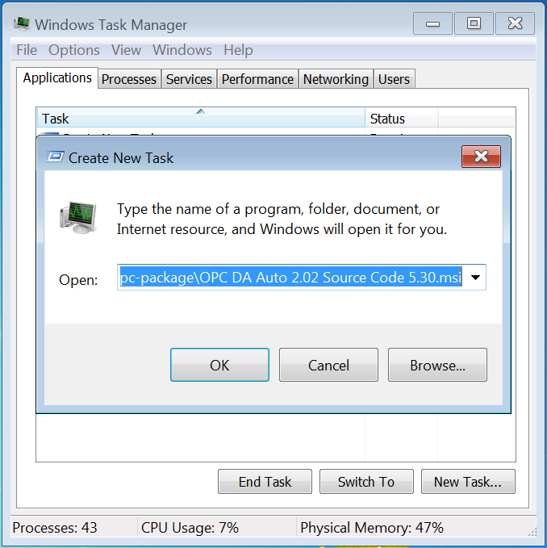
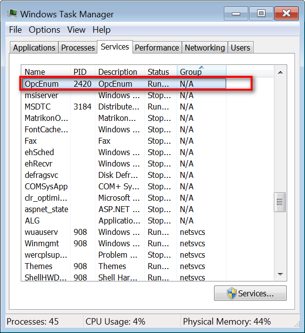
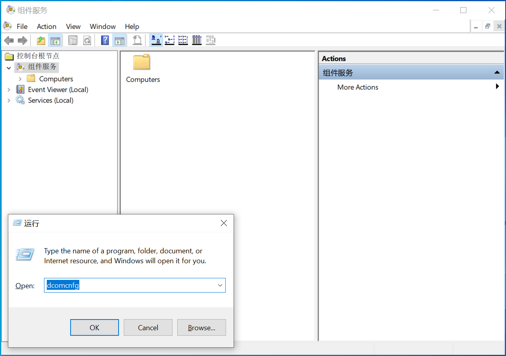
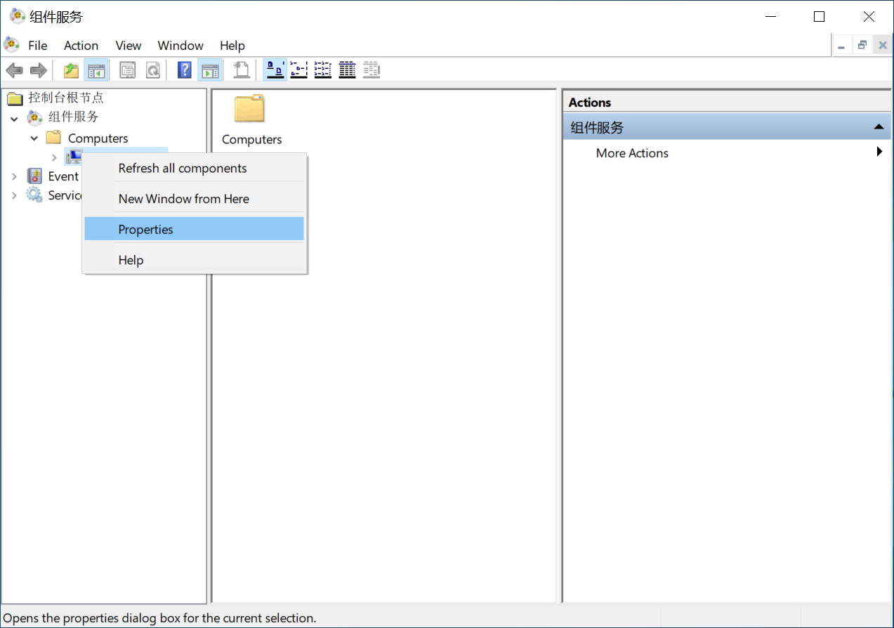
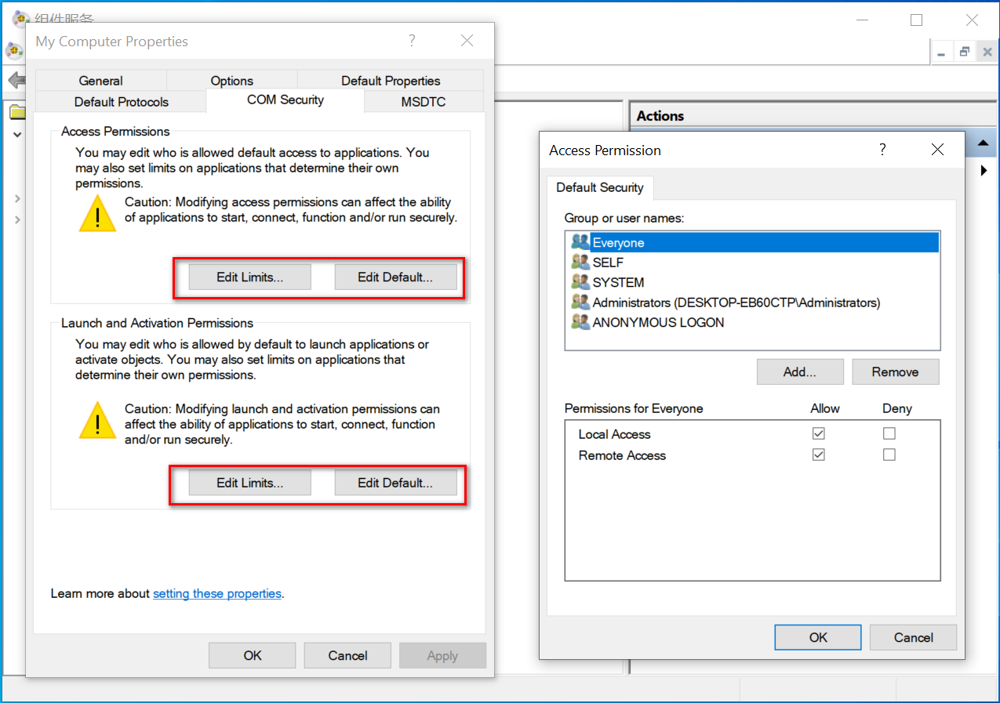
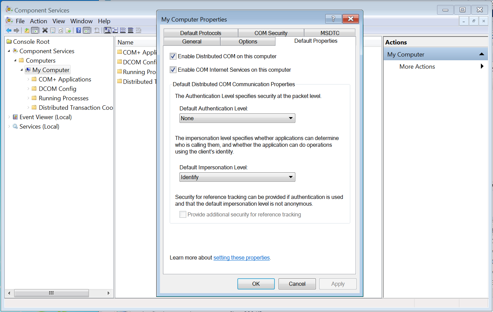
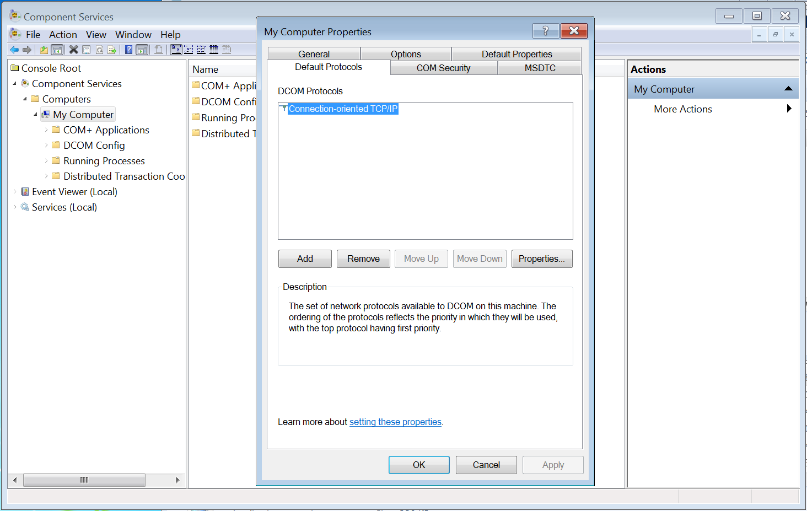
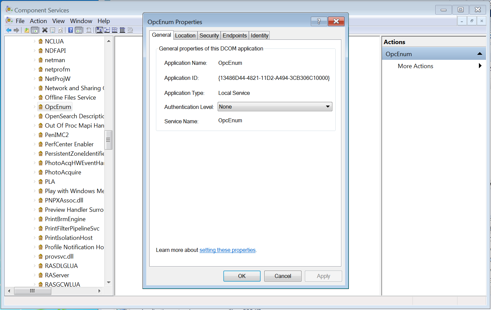

# NeuOPC Settings

## Native OPCDA server access

This example uses windows 7 SP1 32-bit system to demonstrate

### Install the neuopc runtime environment

1. Enter neuopc [project page](https://github.com/neugates/neuopc) to download the latest Release component package "neuopc-package.zip". After decompression, you can see the following files:

* neuopc - the main program to run OPCDA to convert OPCUA;
* dotnetfx-1.1——.Net framework 1.1, you need to correct this program before installing OPC DAAuto;
* OPC DA Auto 2.02 Source Code 5.30.msi - the official component of the OPC Foundation, Install using "Windows Task Manager";
* OPC Core Components Redistributable (x64) 3.00.108.msi - OPC Foundation official components, no need to install;
* OPC Core Components Redistributable (x86) 3.00.108.msi - OPC Foundation official components, no need to install;

2. Check if .Net framework 1.1 has been installed, if not, install dotnetfx-1.1;

3. Use the task manager to install OPC DA Auto 2.02 Source Code 5.30.msi, open the "Windows Task Manager", open "File" - "New Task", enter the MSI file path, and check "Create this task with system administrative rights";

4. Check if the component is installed

* If it is a 32-bit operating system, enter the C:\Windows\System32 directory, if it is a 64-bit operating system, enter the C:\Windows\SysWOW64 directory, and check whether the following files exist:

::: tip
If the file does not exist then contact sales for support.
:::

* Open "Windows Task Manager" to check whether the OpcEnum system service is running, as shown in the figure:

::: tip
If it works normally, it means that OPC DA Auto 2.02 has been installed normally.
:::

5. Install the MatrikonOPCSimulation simulator program locally, if the installation fails, you can install KepServerEX for testing;

6. Run the neuopc.exe program, select DA Host and DA Server and click Connect, set the parameters of UA and click Run, the operation is successful, as shown in the figure:

## Remote host OPCDA server access

In this example, the host set above is used as a client to connect to another host in the LAN to realize cross-host OPCDA data reading and conversion. The remote host uses the Windows 10 x64 operating system for demonstration.

### Remote host DCOM settings

Install MatrikonOPC Server for Simulation on the remote host, and close the firewall of the computer. The demo uses the Administrator account.

1. Press the WIN + R keys and enter dcomcnfg in the pop-up dialog box to confirm and enter the component service, as shown in the figure:

2. First set the overall properties of the machine, expand "Component Services\Computers\My Computer", right-click My Computer to open the Properties setting in the menu:

Check "Enable Distributed COM on this computer" in "Default Properties", and set "Default Authentication Level" to "None":

In "Default Protocols" keep only "Connection-oriented TCP/IP":

In "COM Security", add "Everyone", "Administrators", and "ANONYMOUS LOGON" users to "Edit Limits" and "Edit Default Limits" in "Access Permissions" and "Launch and Activation Permissions" respectively, and set them Check all permissions below:

3. Expand "Component Services\Computers\My Computer\DCOM Config", set the properties of "OpcEnum" and "MatrikonOPC Server for Simulation and Testing" respectively, and select "None" in "General"-"Authentication Level":

在"Location"中勾选"Run application on the computer where the data is located"和"Run application on this computer"：

In "Security", select Custom for all permissions and add users "Everyone", "Administrators", and "ANONYMOUS LOGON" respectively, and check all permissions under them:

4. Make sure to close the system firewall or add a security policy to allow programs such as OpcEnum and Matrikon to pass through.

So far, the remote host test environment of OPCDA has been set up.

### Localhost DCOM Settings

In order to remotely access the set remote host, it is also necessary to perform DCOM settings on the local host. Here, continue to use the windows 7 SP1 32-bit system demo configured in [Local OPCDA Server Access] above, except for the configuration content "MatrikonOPC Server for Simulation and Testing ", consistent with the remote host, close the firewall of the local host before starting.

1. First set the overall properties of the machine, expand "Component Services\Computers\My Computer", right-click My Computer to open the Properties setting in the menu, the content and method of setting are consistent with the remote host:

2. Expand "Component Services\Computers\My Computer\DCOM Config", set "OpcEnum", the content and method of setting are consistent with the remote host:

3. Make sure to close the system firewall or add a security policy to allow the OpcEnum program to pass.

So far, the local host test environment of OPCDA has been set up.

