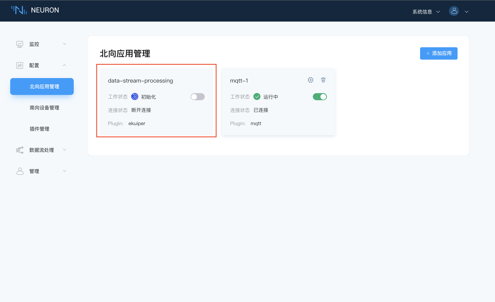
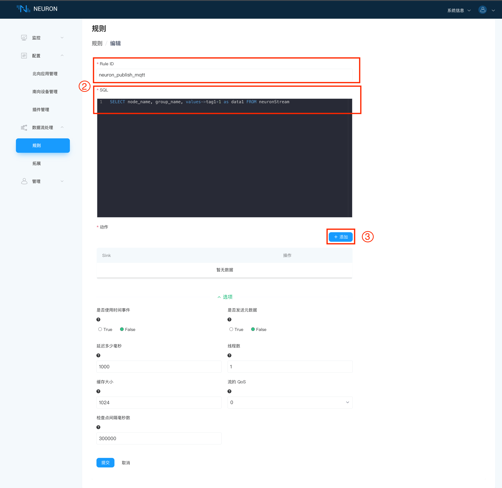
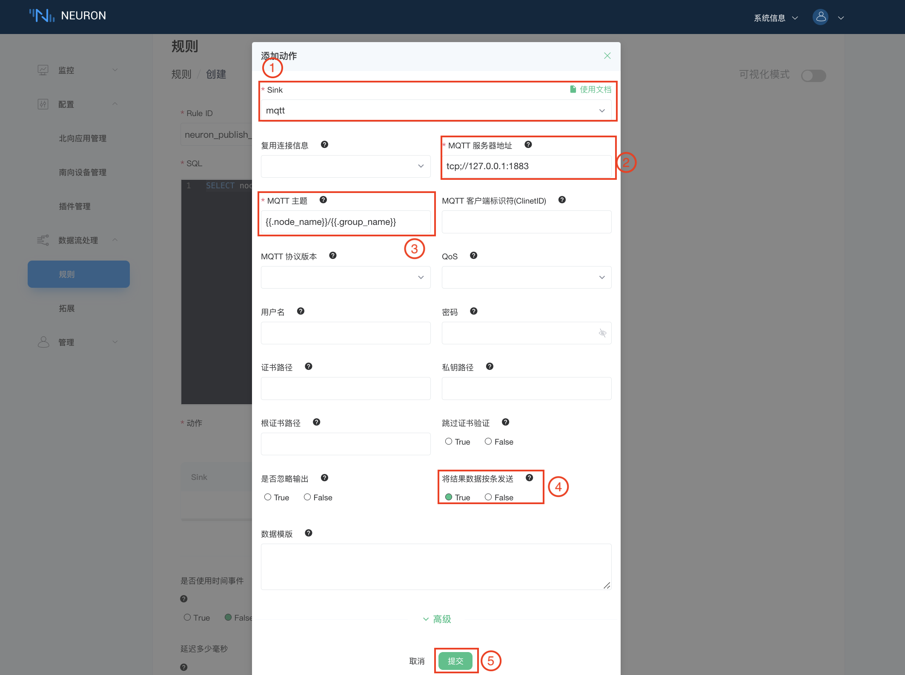
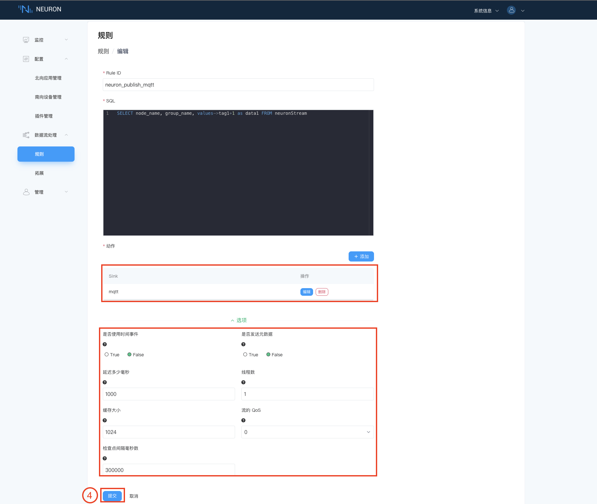
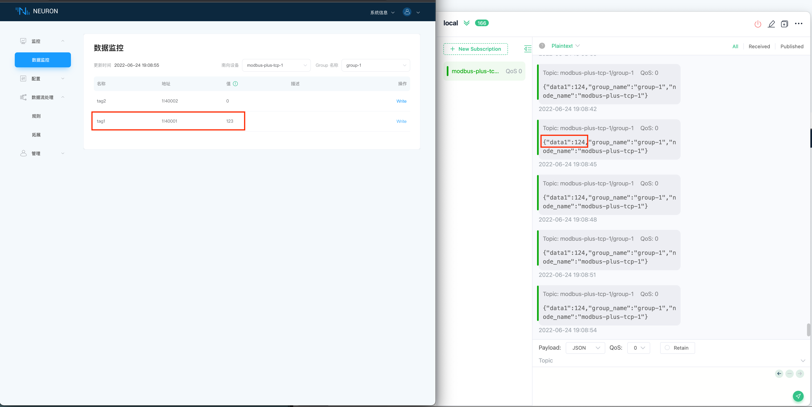
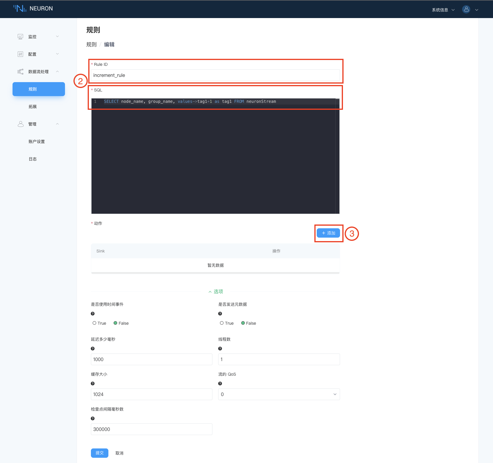
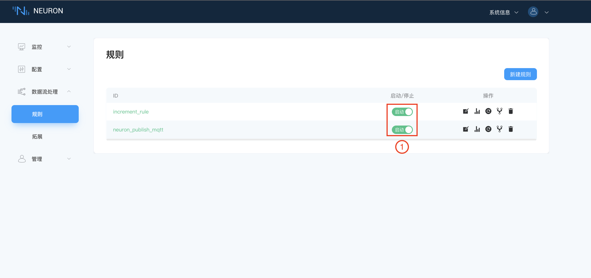

# 数据处理引擎

数据流引擎中预先定义了一个名为 `neuronStream` 的数据流，其属性为`neuron`。这个数据流收集 neuron 从各个设备采集过来的数据，所有规格都将共享此数据流。本节将介绍**清洗数据到云端**和**反控设备**两条规则。

第一步，订阅 Group：

点击 `data-stream-processing` 应用节点以转到订阅 Group 的界面，如下图所示。

1. 点击右上角`添加订阅`；
2. 点击下拉框，选择南向设备，本例中选择已构建的**modbus-plus-tcp-1**；
3. 点击下拉框，选择要订阅的 Group，本例中选择已构建的 **group-1**；
4. 点击`提交`按键完成订阅，如下图所示。

第二步，添加清洗数据到云端的规则

本模块实现将 neuron 从设备采集到的数据进行 +1 处理，并重命名为有意义的名字后，将结果发送到云端的 MQTT 动态 topic `${node_name}/${group_name}`中。

1. 点击`新建规则`，进入新建规则界面；
2. 填写 `Rule ID` 和`SQL` 的描述；
3. 点击`添加` ，为规则添加 sink 动作，每条规则可添加多条 sink 动作；
4. 点击`提交` 完成规则的定义。

::: v-pre

1. 下拉选择 Sink；
2. 填写 MQTT 服务器地址；
3. 填写 MQTT 主题，本例中使用 `{{.node_name}}/{{.group_name}}`；
4. 选择 `True` 以将结果数据按条发送；
5. 选择 `提交` 完成 sink 动作的添加。
:::

规则如下图所示。

1. 启动规则，如下图所示。

::: v-pre

1. 启动 MQTTX ，订阅主题 `{{.node_name}}/{{.group_name}}`，结果如下图所示。
:::

::: tip
此例中使用的 node_name 为 **modbus-plus-tcp-1**，group_name 为**group-1**，即，订阅主题为 modbus-plus-tcp-1/group-1。
:::

第三步，添加反控设备的规则

本模块实现将 neuron 从设备采集到的数据进行 +1 处理，neuron 将结果写到设备中，此时 tag 属性需要有写属性，否则无法写成功。

1. 点击`新建规则`，进入新建规则界面；
2. 填写 `Rule ID` 和`SQL` 的描述；
3. 点击`添加` ，为规则添加 sink 动作，每条规则可添加多条 sink 动作；
4. 点击`提交` 完成规则的定义。

1. 下拉选择 Sink；
2. 填写节点名称；
3. 填写分组名称；
4. 填写标签字段；
5. 选择 `提交` 完成 sink 动作的添加。

规则如下图所示。

1. 启动规则，如下图所示。

1. 打开 neuron 数据监控，查看数据。