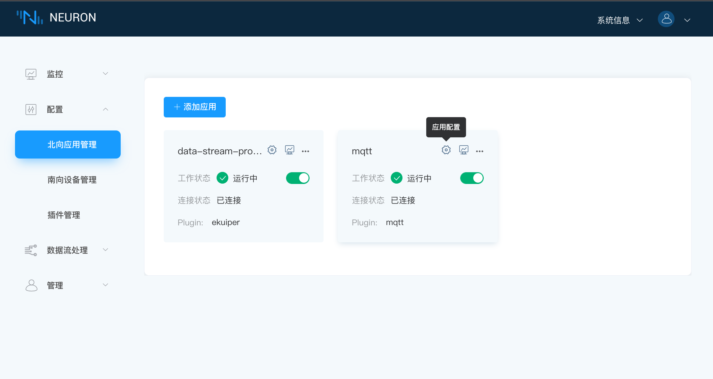

# 快速教程

## 环境搭建

### 软件包安装Neuron

实例中使用的环境是Ubuntu 20.04.3，armv71。

Neuron 软件包可从 Neuron 网站[https://neugates.io/zh/downloads](https://neugates.io/zh/downloads)上下载。

解压软件包到任何目录下（例如：/home/Neuron），输入命令：

```bash
sudo dpkg -i neuron-2.0.0-beta.1-armhf.deb
```

**注意：** 安装 deb 包后，自启动Neuron

查看 Neuron 状态

```bash
systemctl status neuron
```

停止 Neuron

```bash
systemctl stop neuron
```

重启 Neuron

```bash
systemctl restart neuron
```

### 在 Docker 中运行 EMQX Edge

我们需要部署一个 MQTT Broker 来做消息的连接处理，这里推荐使用[EMQX Edge](https://www.emqx.cn/downloads#edge)，轻量级的边缘计算消息中间件。同样EMQX Edge可以快速使用Docker容器安装使用。

获取 Docker 镜像（请在官网中获取最新版本）

```bash
docker pull emqx/emqx-edge:4.2.2
```

启动 Docker 容器（请在官网中获取最新版本）

```bash
docker run -d --name emqx -p 1883:1883 -p 18083:18083 emqx/emqx-edge:4.2.2
```

### 资源准备

安装 PeakHMISlaveSimulator，安装后，打开 Modbus TCP slave.
提示：Windows中尽量关闭防火墙，否则可能会导致 Neuron 连接不上模拟器。

## 运行和使用

当环境和资源都准备好后，打开 Web 浏览器，输入运行 Neuron 的网关地址和端口号，即可进入到管理控制台页面，默认端口号为7000，例如：[http://127.0.0.1:7000](http://127.0.0.1:7000)。

### 1.登录

打开页面，进入到登录界面，用户可使用初始用户名与密码登录（初始用户名：admin，初始密码：0000），如下图所示。


### 2.南向配置

在`配置`菜单中选择`南向设备管理`，进入到南向设备管理界面，此时未添加任何设备。点击`添加设备`按键，手动添加设备，填写设备名称并下拉选择插件，在本例中，我们创建 Modbus TCP 的设备连接，插件选择 modbus-tcp-plugin，如下图所示。


创建设备成功之后，会在南向设备管理界面出现一个刚刚创建的设备的卡片，此时设备的工作状态在初始化状态中，连接状态在断开连接状态中，如下图所示。


在新创建的设备卡片中选择`设备配置`，进行设备配置，如下图所示，带 “ * ”是必填项，每项后面都有一个字段说明键，鼠标放置在上面，将会显示详细的说明信息。在本例中，我们使用的是 Modbus TCP 的模拟器，Host项应该填写该模拟器所运行的IP地址，Port填写对应的端口号。
注意：运行的Neuron和模拟器必须要在同一个网段下。


配置完成后，在填写的信息正确的条件下，将该设备的工作状态置为运行后，连接状态变为“已连接”，设备进入工作状态，如下图所示，用户也可通过开关按键，停止设备的工作。


完成以上操作之后，便可以进入 Group 配置，轻点设备卡片的任意空白处，即可进入到该设备的 Group 列表中，点击`创建`按钮创建 Group，填写 Group 名称及上报数据的时间间隔，如下图所示。


Group 创建完成后，对应 Group 列表中会显示刚新建的 Group，用户此时也可点击编辑键修改刚创建的 Group 的配置，如下图所示。


下一步点击tags列表键进入到tags列表界面，如下图所示。


点击`创建`按钮进到创建 Tags 页面，对应填写 Tag 信息。在创建 Tags 页面中，点击`添加`按钮可创建一个新的Tag，以此实现同时创建多个Tag的功能，如下图所示。


创建完成后，如下图所示，此时可进行编辑/删除Tag操作。


此时南向配置已全部完成，用户可在`监控`菜单下选择`数据监控`，下拉框选择想要查看的南向设备及 Group，页面将会对应显示监测到的数据，如下图所示。对照模拟器，可以看到监控到的数据与模拟器的数值一致，如下图所示。


在 Tag 属性设置了写属性的时候，数据监控界面的 Tag 会有一个写操作，点击`Write`可改写该Tag的数值，如下图所示。


### 3.北向配置

在`配置`菜单中选择`北向应用管理`，进入到北向应用管理界面，初次打开这个界面时没有任何应用，此时需要手动添加应用，点击右上角的`添加配置`按键，填写应用名称，选择应用插件，如下图所示。


添加完成后，页面自动跳回到北向应用管理界面，此时添加的应用的工作状态为初始化状态，连接状态为断开连接，下一步点击`应用配置`按键，进入到应用配置界面，根据界面填写相关信息完成应用配置，如下图所示。


此时，应用的工作状态转为准备中，打开应用的工作按钮使设备进入到工作状态中，在应用配置正确的情况下，连接状态应转为已连接状态，如下图所示，用户也可手动停止应用。



下一步，点击应用卡片的任意空白处进入到订阅Group界面，点击右上角的`添加订阅`按键添加订阅，下拉框选择南向设备及想要订阅的Group，如下图所示。


订阅完成后，我们可以使用MQTT客户端（这里推荐使用 MQTTX）连接到刚才部署好的 EMQX Edge 来查看上报的数据。打开MQTTX 添加新的连接，正确填写名称与刚部署好的 EMQX Edge 的 Host 与 Port，完成连接。下一步，添加新的订阅，Topic的主题格式为`neuron/{mqtt_clientid}/read/resp`，其中{mqtt_clientid}是在 Neuron 界面中北向应用中配置的`Client-id`，订阅成功之后可以看到 MQTTX 可以一直接收到 Neuron 采集并上报过来的数据，如下图所示（详细订阅主题可查看 MQTT-Topics 文档）。


