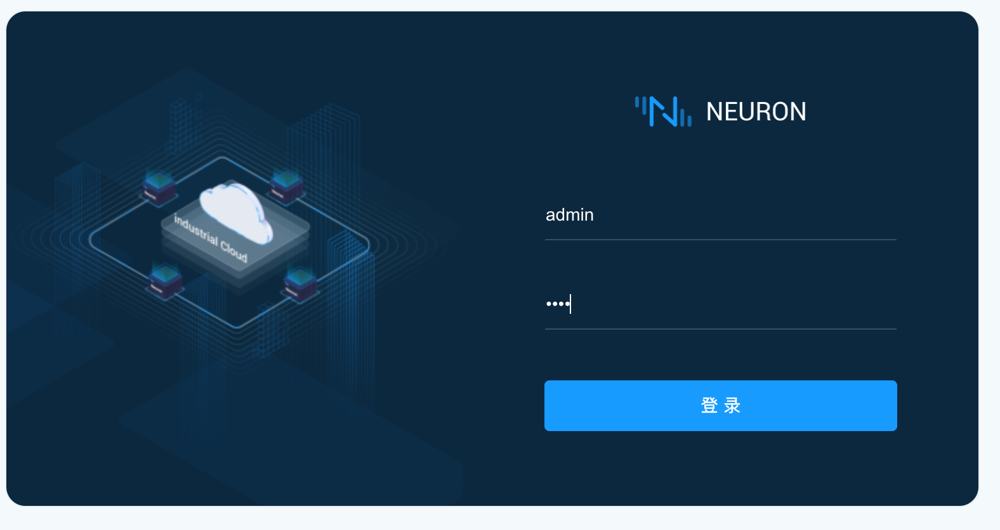
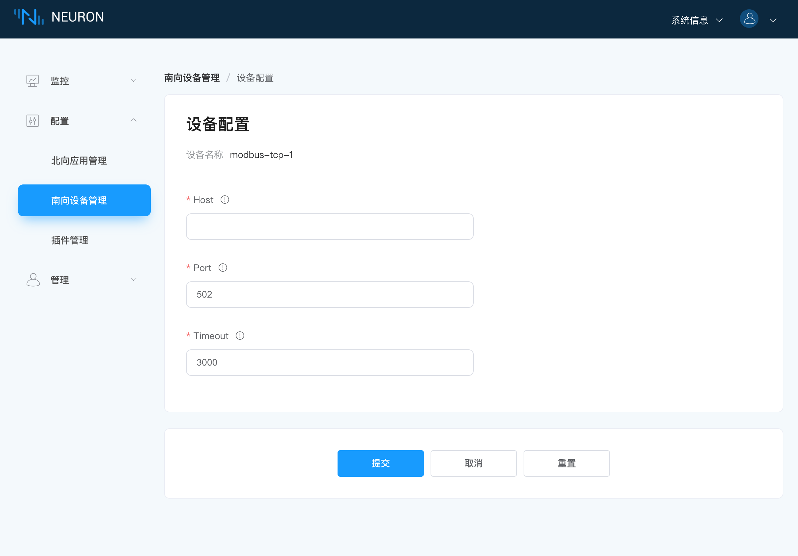
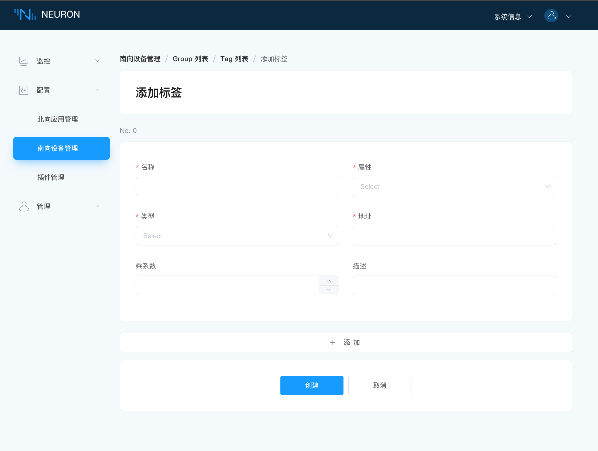
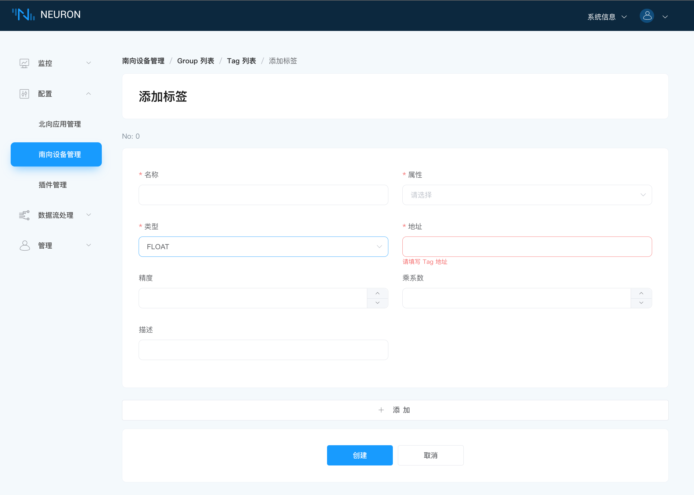
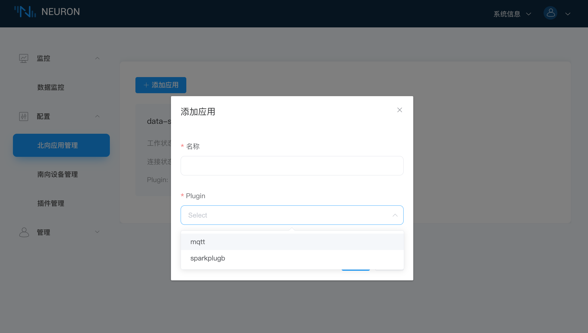

# 快速教程

## 环境搭建

### 软件包安装

实例中使用的环境是 Ubuntu 20.04.3，X86_64。使用 NeuronEX 版本。

1. 下载安装包：NeuronEX 软件包可从 Neuron 官网 [https://neugates.io/zh/downloads](https://neugates.io/zh/downloads) 上下载。

2. 解压安装包：解压软件包到任何目录下（例如：/home/Neuron），输入命令：

```bash
sudo dpkg -i neuronex-2.3.0-linux-amd64.deb
```

::: tip
安装 deb 包后，Neuron 自启动
:::

### Neuron 相关操作

#### 查看 Neuron 状态

```bash
sudo systemctl status neuron
```

#### 停止 Neuron

```bash
sudo systemctl stop neuron
```

#### 重启 Neuron

```bash
sudo systemctl restart neuron
```

### 在 Docker 中运行 EMQX

我们需要部署一个 MQTT Broker 客户端来做消息的连接处理，这里推荐使用 EMQX 。同样 EMQX 可以快速使用 Docker 容器安装使用。可从 [EMQX 官网](https://www.emqx.com/zh/try?product=broker) 获取最新版本。

1. 获取 Docker 镜像

```bash
docker pull emqx/emqx:4.4.3
```

2. 启动 Docker 容器

```bash
docker run -d --name emqx -p 1883:1883 -p 8081:8081 -p 8083:8083 -p 8084:8084 -p 8883:8883 -p 18083:18083 emqx/emqx:4.4.3
```

### 安装 Modbus 模拟器

安装 PeakHMISlaveSimulator 软件，安装包可在 [PeakHMI 官网](https://hmisys.com) 中下载。
安装后，打开 Modbus TCP slave.

::: tip
Windows 中尽量关闭防火墙，否则可能会导致 Neuron 连接不上模拟器。
:::

## 运行和使用

当环境和资源都准备好后，打开 Web 浏览器，输入运行 Neuron 的网关地址和端口号，即可进入到管理控制台页面，默认端口号为7000，例如：[http://127.0.0.1:7000](http://127.0.0.1:7000)。

### 第一步，登录

打开页面，进入到登录界面，用户可使用初始用户名与密码登录（初始用户名：admin，初始密码：0000），如下图所示。



登录到控制面板：

1. 填写默认用户名 `admin`.
2. 填写默认密码 `0000`.
3. 点击 `登录` 按键.

### 第二步，为设备驱动添加南向插件模块

在`配置`菜单中选择`南向设备管理`，进入到南向设备管理界面，此时未添加任何设备，在本例中，我们将创建 Modbus TCP 设备，如下图所示。


添加一个新的南向设备：

1. 单击右上角的`添加设备`按键以显示添加新设备的对话框；
2. 填写设备名称，例如 modbus-tcp-1；
3. 点击下拉框，将显示现在可用的所有南向驱动协议，此次我们选择 modbus-tcp 的插件；
4. 点击`创建`按键创建设备。

::: tip
你如果安装了有效的试用版或者商业版许可证，可以使用除了 modbus-tcp 插件以外的插件模块。南向驱动列表中只有 modbus-tcp 是开源插件模块。
:::

### 第三步，管理南向设备节点列表

创建设备成功之后，会在南向设备管理界面出现一个新创建的设备的卡片，如下图所示。


这个设备卡片包含以下信息：

1. 设备名字 - 用户为设备提供的唯一名称。
2. 设备配置按键 - 单击此按键可显示设备配置界面。
3. 删除按键 - 单击此按键可将此设备从南向设备列表中删除。
4. 节点状态 - 显示设备节点的当前状态，详情见下文。
5. 状态切换按键 - 打开以连接到设备。
6. 连接状态 - 显示设备的连接状态。
7. 插件模块名称 - 用于显示此设备使用的插件模块的名称。

每个南向设备都有五种工作状态。

* **初始化**：首次添加南向设备卡片后，进入初始化状态；
* **配置中**：进入设备配置中，进行设备配置时，进入到配置中的状态；
* **准备好**：成功配置设备后，进入到准备好的状态；
* **运行中**：手动打开工作状态，进入到运行状态，在添加 Group 和 Tag 后，Neuron 连接到设备采集数据；
* **停止**：手动关闭工作状态，进入到停止状态，neuron 断开与设备的连接，停止采集数据；

### 第四步，设置南向设备参数

点击`设备配置`，进入设备配置界面，如下图所示。



带 ` * ` 是必填项，每项后面都有一个字段说明键，鼠标悬停在上面，将会显示详细的描述信息。

1. 填写运行 Modbus 模拟器的 IP；
2. 填写 Modbus 模拟器的端口号，默认是 502；
3. 填写连接请求超时时间，默认是 3000；
4. 点击提交，完成设备配置，设备卡片自动进入**运行中**的状态；

::: tip
运行的 Neuron 和模拟器必须要在同一个网段下。

不同的驱动，配置参数有所区别，详细的驱动配置参数说明可参考 [模块配置](../module-plugins/module-driver.md)。
:::

### 第五步，在节点中创建组

点击设备节点卡片任意空白处，进入 Group 列表管理界面，此时会显示一个空的列表，如下图所示。


为设备节点创建一个组：

1. 点击`创建`按键，弹出`创建 Group` 的对话框；
2. 填写 Group 名称，例如 group-1；
3. 填写 Interval，设置 neuron 从设备采集数据的时间间隔及将数据上报到 MQTT 的时间间隔。最小可设置 100ms，但在采集的数据较多时，如果数据监控界面报点位值失效的错误，可以适当调大 interval 的值；
4. 点击`提交`，完成组的创建。

### 第六步，管理群组列表

Group 列表中会显示刚新建的组，如下图所示。


组列表中包含了以下信息：

1. `导入`按键，以 Excel 形式，并以组为单位批量导入。`导出`按键，导出选中的组的信息到 Excel 中。`创建`按键用于创建新的组。`清空`按键，一键删除所有已创建的组。当用户选择了一些组后，点击`删除`按键，可以快速批量删除选中的组。
2. 全选列表中的所有组。
3. 单选列表中的某个组。
4. `编辑` 图标用于修改组的配置信息。
5. `Tag 列表` 图标用于为当前组创建 tags。
6. `删除` 图标用于删除当前组。

:::tip
详细的导入/导出功能请参考 [点位配置导入导出](../user-guide/configuration-import-export.md)。
:::

### 第七步，添加数据标签到组中

点击组中的 `Tag 列表` 图标，进入到 Tag 列表管理界面，如下图所示。


选择`创建`按键，进入添加 Tags 页面。

### 第八步，设置数据标签详细信息



所有数据标签将被手动一一添加，以向您展示如何设置标签详细信息。

为组创建标签：

1. 填写 Tag 名称，例如，tag1；
2. 下拉选择 Tag 属性；
3. 下拉选择数据类型，例如，int16。由于每个驱动支持的类型不同，下拉框可选择的数据类型也就不同；
4. 填写驱动地址，例如，1!40001。详细的驱动地址使用说明请参阅 [模块配置](../module-plugins/module-driver.md)；
5. 可选参数 Decimal，可设置 Neuron 采集数值后的乘数，例如 neuron 采集到的数值是 11，Decimal 设置为 0.1，则该点位显示的数值为 1.1；
6. 可选参数 Description，用于给标签添加一些描述信息；
7. 单击`添加`按键添加下一个标签，重复 1-6 的步骤直到添加到最后一个标签；
8. 新增一个标签后，信息框旁边会增加一个`删除`按键，可选择删除该标签；
9. 点击`创建`按键，完成 Tag 的创建；

::: tip
目前，Tag 属性支持 Read, Write, Subscribe 三种，当选择 Subscribe 属性时，只有在采集到的数值发生变化时，才会将变化后的数值上传到云端。

当数据类型选择 float/double 时，会显示一个可选参数 precision，用于设置精度，可选范围 1-17。
:::



### 第九步，管理组的数据标签

完成所有标签创建后，标签列表，如下图所示。


* `创建`按键，创建新的标签；
* `清空`按键，一键删除所有的标签；
* `删除`按键，在选择全选时，再点击`删除`按钮，效果等同于`清空`，可删除所有 tag。当单选某些 tag 时，再点击`删除`按键，可快捷批量删除选择的 tag；
* 全选列表中的所有标签；
* 单选列表中的某个标签；
* `编辑`按键，每个标签包含了名称，地址，类型，读写属性，描述，重新编辑标签信息的按键；
* `删除`按键，删除该标签；

### 第十步，查看数据监控中的数据

在`监控`菜单下选择`数据监控`，进入数据监控界面，查看已创建标签读取到的数值，如下图所示。


数据监控以组为单位：

1. 下拉框选择想要查看的南向设备，这里选择上面已经创建好的 modbus-tcp-1;
2. 下拉框选择想要查看所选南向设备下的组，这里选择上面已经创建好的 group-1；
3. 选择完成，页面将会展示读取到组底下每一个标签的值；

::: tip
您如果发现数值是一个无效的数值，您可以在模拟器中调整字节顺序的设置。Modbus TCP 模拟器的字节顺序默认是 BE 3,4,1,2
:::

### 第十一步，更改模拟器数据标签值

通过设置模拟器里寄存器的值，查看数据监控显示的值是否与模拟器中的值一致，如下图所示。


### 第十二步，在界面中输入反控设备的值

当 Tag 设置了写属性，数据监控界面的 Tag 会有一个写操作，当该点位在设备上也具有可写属性时，点击`Write`可以实现反控设备，如下图所示。


1. 单击要改值的标签末尾的`写`按键；
2. 选择是否以十六进制方式输入；
3. 输入标签新值；
4. 单击`提交`按键提交新的值。

### 第十三步，为应用程序添加北向插件模块

在`配置`菜单中选择`北向应用管理`，进入到北向应用管理界面，会有一个默认的数据流应用节点，如需要，可手动添加更多的应用节点，在本例中，我们将创建一个 mqtt 应用节点，如下图所示。



添加一个 MQTT 云连接模块：

1. 点击右上角的`添加应用`按键；
2. 填写应用名称，例如，mqtt-1；
3. 点击下拉框，将显示现在可用的所有北向应用，此次我们选择 mqtt 的插件。

### 第十四步，管理北向应用节点列表

创建应用成功之后，会在北向应用管理界面出现一个刚刚创建的应用的卡片，如下图所示。


应用卡片中包含应用名称，设备配置按键，删除按键，工作状态，连接状态和该设备卡片使用的插件名称，点击卡片任意空白处，还可进入 Group 列表管理界面。

应用节点包括以下信息：

1. 应用名称 - 用户为应用程序设置的唯一名称；
2. 应用配置按键 - 单击此按键以显示应用程序配置界面；
3. 删除按键 - 单击此按键可将此应用程序从应用程序列表中删除；
4. 节点状态 - 显示应用节点的当前状态，详情见下文；
5. 状态切换按键 - 打开以连接到应用程序；
6. 连接状态 - 显示应用程序当前连接状态；
7. 插件模块名称 - 用于显示此应用程序使用的插件模块的名称。

每个北向应用节点都有五种工作状态：

* **初始化**：首次添加北向应用卡片后，进入初始化状态；
* **配置中**：进行应用配置时，进入到配置中的状态；
* **准备好**：成功配置应用后，进入到准备好的状态；
* **运行中**：手动打开工作状态，进入到运行状态，neuron 连接到北向应用，进行传输数据；
* **停止**：手动关闭工作状态，进入到停止状态，neuron 断开与北向应用的连接，停止传输数据；

### 第十五步，设置北向应用参数

点击`应用配置`按键，进入到应用配置界面，如下图所示。


带 ` * `是必填项，鼠标悬停在后面的字段说明图标上，将会显示详细的说明信息。

设置 MQTT 连接：

1. 必填，填写订阅数据上报的主题，详细订阅主题请参阅 [MQTT API](../reference/mqtt-api.md)；
2. 必填，填写心跳报文上报的主题；
3. 选择上传格式；
4. 选填，当 mqtt 连接异常时，设置上传数据缓存的大小限制；
5. 设置 SSL 认证选项；
6. 填写 MQTT Broker 的 hostname，这里默认连接的是 emqx 公共的 broker；
7. 填写 MQTT Broker 的端口号；
8. 选填设置的用户名；
9. 选填设置的密码；
10. 点击`提交`，完成北向应用的配置，应用卡片自动进入**运行中**的状态。

### 第十六步，订阅南向标签组

点击应用节点卡片任意空白处，进入到订阅 Group 界面，如下图所示。


订阅南向设备的数据组：

* 点击右上角的`添加订阅`按键添加订阅；
* 点击下拉框选择南向设备，本例我们选择上面建好的 modbus-tcp-1 的设备；
* 点击下拉框选择所要订阅的 Group，本例我们选择上面建好的 group-1；
* 点击`提交`，完成订阅。

### 第十七步，管理订阅的群组列表

成功添加订阅后， Group 列表中将显示所有订阅的 Group，如下图所示。


组列表包含了以下信息：

* `清空`按键，一键取消所有订阅的 Group。
* `删除`按键，在选择全选时，再点击`删除`按钮，效果等同于`清空`，可取消所有 Group 的订阅。当单选某些 Group 时，再点击`删除`按键，可快捷批量取消已选择的 Group 的订阅。
* 每个组都包含了组名称，设备名称和`删除`按键。

### 第十八步，查看 MQTT 代理中的负载

订阅完成后，我们可以使用 MQTT 客户端（这里推荐使用 MQTTX，可在官网中下载[https://www.emqx.com/zh/products/mqttx](https://www.emqx.com/zh/products/mqttx) 连接到刚才部署好的 EMQX 代理来查看上报的数据，如下图所示。


订阅成功之后可以看到 MQTTX 可以一直接收到 Neuron 采集并上报过来的数据。

* 打开 MQTTX 添加新的连接，正确填写名称与刚部署好的 EMQX Edge 的 Host 与 Port，完成连接;
* 添加新的订阅，默认的上传 Topic 的主题格式为`/neuron/{node_name}/upload`，其中 {node_name} 是在 Neuron 界面中北向应用中配置的，本例我们填写上面设置好的 `/neuron/mqtt-1/upload`；

:::tip
当点位设置了 Subscribe 属性时，只有在采集到的数值发生变化时，才会将变化后的数值上传到云端。
:::
