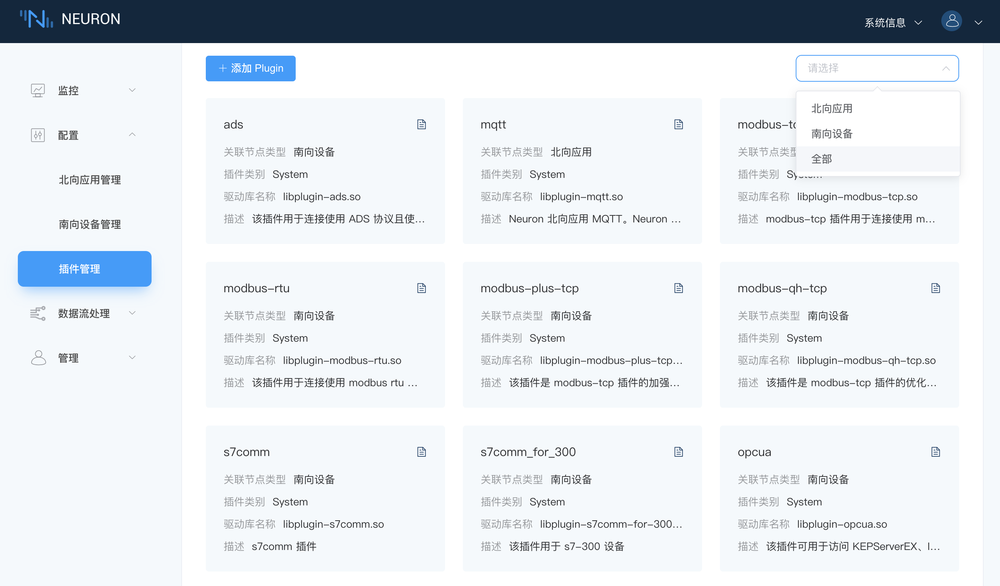

# 插件模块管理

## 查看所有可用模块

插件管理页面显示所有可用的可插拔模块和详细信息，包括插件名称、关联节点类型、驱动库名称和描述信息，如下图所示。

插件卡片右上角的 `文档` 按键，可跳转到该驱动具体的使用及说明的文档处。

插件类型包括以下三种模式：

* Static：不可删除
* System：不可删除，软件自带
* Custom：可删除，用户自己开发或者是定制开发的

:::tip
用户可以从下拉框中选择北向应用程序或南向设备的插件。
:::

## 添加一个新的可插拔模块

点击左上角的`添加Plugin`按钮如下图所示。

添加一个新的可插拔模块：

* 填写需要添加的 .so 文件的路径和文件名。
* 单击“创建”按钮将 .so 文件添加到构建目录。

:::tip
请确保已将自己编写的 .so 插件文件放置在 neuron/build/plugins 目录底下后，再进行添加。具体的插件开发教程请参考 [SKD 教程](../project/sdk/sdk_based-driver-development.md)。
:::
